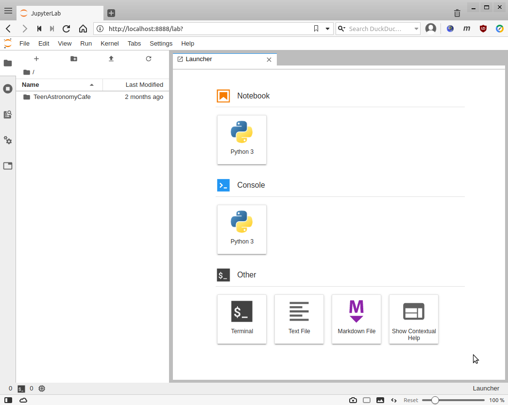

# astrocafe
Notebooks for TeenAstronomyCafe, in a Docker container.

You only need Docker to be installed. Everything else comes with the container.

## First time only: Install Docker

### MacOS

Install "Docker for Mac", following the instuctions here:

https://docs.docker.com/docker-for-mac/install/

### Linux

## Run the AstroCafe Docker container

If this is the first time you are working with the AstroCafe notebooks, open a terminal window and type these two commands:

```
git clone https://github.com/noaodatalab/astrocafe.git
cd astrocafe
```

From here on, and in the future, simply run this command to start up the Docker container for AstroCafe:
```
./run.sh
```
  
If this is the first time you are running this command, it will
download the Docker image from Docker Hub, and will also download the
data needed to run some of the AstroCafe notebooks. Depending on the
speed of your internet connection, this will take several minutes.

Next time, `./run.sh` will skip the downloads, as they are already
present on your computer.

Finally, when the script tells you this:

```
############################################################
       Point your prowser to: http://localhost:8888
############################################################
```

simply open up a browser window, and type (or copy and paste) this URL into it:

```
http://localhost:8888
```

A JupyterLab environment, with all the AstroCafe notebooks, and the
required data files, will open, and should look like this:


